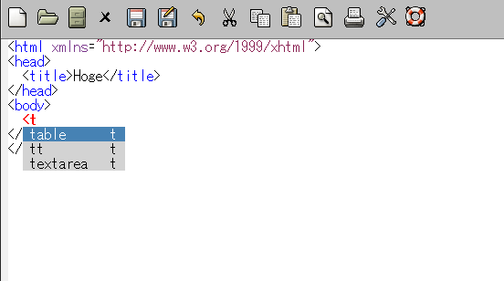
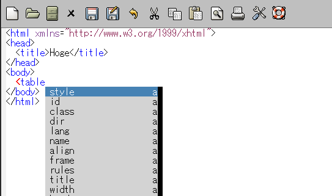
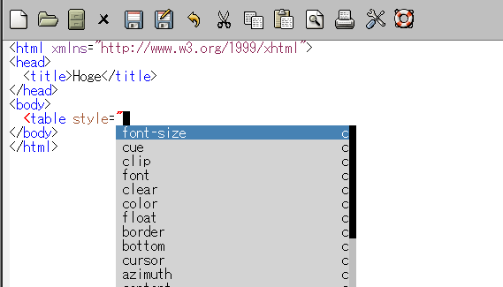

What's this?
============

Extension of Emacs provides completion by auto-complete.el on nXML-mode.

Screen shot
===========

When you are on nXML-mode, keystroke "<". Then ...

Subsequently, if you select "table" ...

Subsequently, if you select "style" ...

Subsequently, if you select "font-size" ...

Feature
=======

### Start completion automatically

On nXML-mode, completion is started when you keystroke the bound key for starting completion defalut "C-RET".  
I think this action is good when completion use default interface of Emacs.  
But the interface of auto-complete.el is lighter than it.  
So, start completion automatically according to the context as much as possible.

### CSS property and its value are available as the candidate

nXML-mode can't complete CSS property and its value.  
But their definition are in auto-complete.el.  
So, CSS property and its value are available when completion of attribute value.

### Do completion when you are on the content of the element.

nXML-mode can't complete on the content of the element.  
But their definition exists in the used schema of RELAX NG and XML Schema.  
So, when you are on the content of the element, do completion using them.  
If it is not selective, do completion using the words in the nXML-mode buffers that you opened.

### Completion of word using anything-project.el

When you are in not selective content of the element, can use only the words in the opened buffer.  
But it is too much trouble.  
So, if anything-project.el is available, do completion using the words in the project files of anything-project.el.

### Complete available "xmlns" attribute automatically

nXML-mode can manage the namespace of the used schema.  
For example, if you wrote the following,  

    <html xmlns="http://www.w3.org/TR/xhtml1"
          xmlns:math="http://www.w3.org/1998/Math/MathML">

the defined in "http://www.w3.org/TR/xhtml1" are displayed without prefix,  
the defined in "http://www.w3.org/1998/Math/MathML" are displayed with "math:".  

But when complete "xmlns" attribute,   
nXML-mode don't complete namespace other than the default even if they exists in used schema.  
In this case, you have to know which available namespace is.  
Then, it is too much trouble.  
So, when complete default namespace, complete all available namespaces.

### Popup help of element and attribute

When complete element and attribute, popup help about them beside displayed candidates.  
And when you keystroke the bound key for popup help, popup help abount pointed.  
Abount binding the key for popup help, see Configure section below.

Install
=======

You can install by the following way.

### By auto-install

eval the following sexp.

    (auto-install-from-url "https://raw.github.com/aki2o/auto-complete-nxml/master/auto-complete-nxml.el")

### Otherwise

download "auto-complete-nxml.el" manually and put it in your load-path.

Configure
=========

    (require 'auto-complete-nxml)

    ;; for popup help at point
    (setq auto-complete-nxml-popup-help-key "C-:")

Tested On
=========

* Emacs ... GNU Emacs 23.3.1 (i386-mingw-nt5.1.2600) of 2011-08-15 on GNUPACK
* auto-complete.el ... Version 1.4

Enjoy!!!

